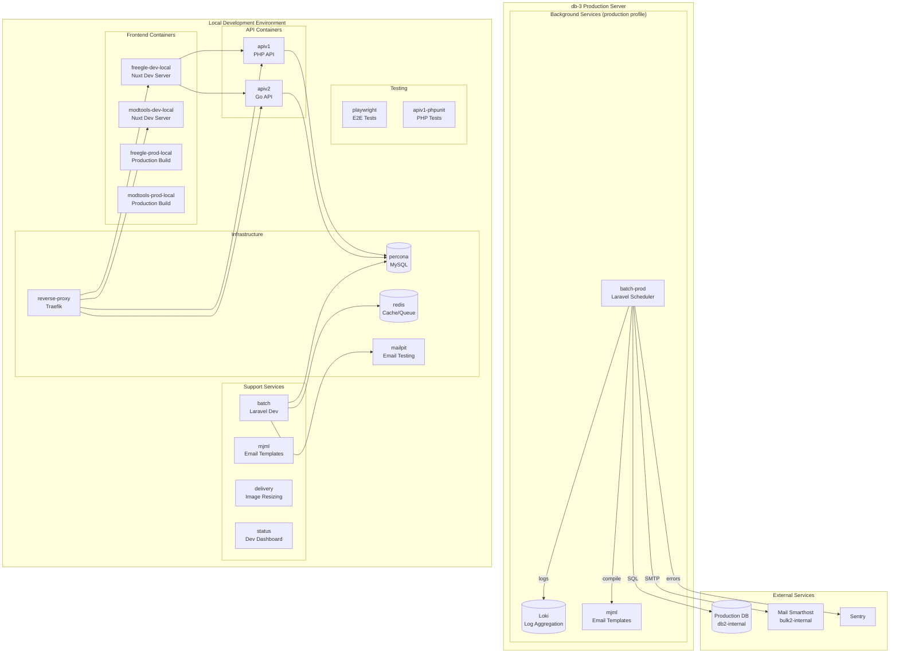

# FreegleDocker Architecture

This document describes the architecture of the FreegleDocker compose environment.

## Deployment Environments

The same docker-compose.yml supports multiple deployment scenarios via profiles and override files:

| Environment | Location | Purpose | Active Profiles |
|-------------|----------|---------|-----------------|
| **Local Development** | Developer machines | Frontend/backend development | (default) |
| **CircleCI** | CI/CD | Automated testing | (default) |
| **db-3 (Production Background)** | db-3.freegle.it | Loki logging, batch jobs | monitoring, production |
| **Yesterday** | yesterday.ilovefreegle.org | Data recovery, testing | Uses override file |

## Architecture Diagram



## Container Groups

### Frontend Containers
| Container | Profile | Purpose |
|-----------|---------|---------|
| `freegle-dev-local` | default | Freegle user site (dev mode, local APIs) |
| `freegle-dev-live` | default | Freegle user site (dev mode, **production APIs**) |
| `freegle-prod-local` | default | Freegle user site (production build, local APIs) |
| `modtools-dev-local` | default | ModTools (dev mode, local APIs) |
| `modtools-prod-local` | default | ModTools (production build, local APIs) |

### API Containers
| Container | Profile | Purpose |
|-----------|---------|---------|
| `apiv1` | default | PHP API (iznik-server) |
| `apiv2` | default | Go API (iznik-server-go) |
| `apiv1-phpunit` | default | PHP API for running tests |

### Background Processing
| Container | Profile | Purpose |
|-----------|---------|---------|
| `batch` | default | Laravel batch jobs (local dev) |
| `batch-prod` | production | Laravel batch jobs (production database) |

### Infrastructure
| Container | Profile | Purpose |
|-----------|---------|---------|
| `percona` | default | MySQL database |
| `redis` | default | Cache and queue |
| `reverse-proxy` | default | Traefik routing |
| `loki` | default | Log aggregation |
| `mjml` | default | MJML email compilation |
| `mailpit` | default | Email testing |
| `delivery` | default | Image resizing (weserv) |

### Testing & Development
| Container | Profile | Purpose |
|-----------|---------|---------|
| `status` | default | Development dashboard |
| `playwright` | default | E2E browser tests |
| `phpmyadmin` | default | Database admin |

## Network Architecture

All containers communicate via Docker's default bridge network using container names as hostnames.

### External Access (via Traefik)
- `*.localhost` domains route through Traefik reverse proxy
- Port 80: HTTP traffic
- Port 3100: Loki (direct)

### Production batch-prod Networking
The `batch-prod` container uses `extra_hosts` to map logical names to infrastructure IPs:
- `db-host` → Production database IP (from `DB_HOST_IP` in `.env`)
- `mail-host` → Mail smarthost IP (from `MAIL_HOST_IP` in `.env`)

This allows the container to reach external production services while remaining in the Docker network for Loki/MJML access.

## Data Flow

### Email Sending (batch-prod)
```
batch-prod → mail-host (bulk2-internal) → External Recipients
                    ↓
            SPF/DKIM signed by bulk2
```

### Log Aggregation
```
All containers → Loki (port 3100) → Grafana (optional)
                      ↓
              GCS Backup (daily)
```

### API Request Flow (Local Dev)
```
Browser → Traefik → freegle-dev-local → apiv1/apiv2 → percona
                           ↓
                      delivery (images)
```

## Configuration Files

| File | Purpose | Committed |
|------|---------|-----------|
| `docker-compose.yml` | Main compose configuration | Yes |
| `docker-compose.override.yml` | Local overrides | No (gitignored) |
| `docker-compose.override.yesterday.yml` | Template for Yesterday server | Yes |
| `.env` | Compose profiles, infrastructure IPs | No (gitignored) |
| `.env.background` | Production secrets for batch-prod | No (gitignored) |
| `.env.background.example` | Template for .env.background | Yes |

## Profiles

| Profile | Purpose | Containers |
|---------|---------|------------|
| (default) | Local development | All non-profiled containers |
| `production` | Production background services | batch-prod |
| `monitoring` | Monitoring stack | (reserved for future use) |
| `backup` | On-demand backup jobs | loki-backup |

To enable profiles, set `COMPOSE_PROFILES` in `.env`:
```bash
# Local development (default)
COMPOSE_PROFILES=

# Production server (db-3)
COMPOSE_PROFILES=monitoring,production
```
