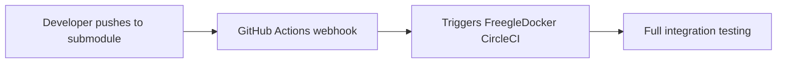

# CircleCI Continuous Integration

This document explains how continuous integration works across the Freegle ecosystem using CircleCI.

## Overview

The Freegle project uses a **centralized testing approach** where the FreegleDocker repository orchestrates integration testing for all components. Individual repositories trigger tests in FreegleDocker rather than running their own isolated tests.

### Why This Architecture?

- **Integration Testing**: Tests the complete system as users experience it
- **Resource Efficiency**: One comprehensive test environment vs. multiple isolated ones  
- **Realistic Testing**: Tests against production-like Docker Compose stack
- **Consistency**: All components tested together with same configuration
- **Prevents Live System Contamination**: Playwright tests run in controlled environment

## Repository Responsibilities

| Repository | Local CI | Integration Testing | Playwright Tests |
|------------|----------|-------------------|------------------|
| **FreegleDocker** | ✅ Full integration testing | ✅ Coordinates all testing | ✅ Runs all E2E tests |
| **iznik-server-go** | ✅ Go unit tests | ➡️ Triggers FreegleDocker | ❌ None (runs in FreegleDocker) |
| **iznik-server** | ✅ PHP unit tests | ➡️ Triggers FreegleDocker | ❌ None (runs in FreegleDocker) |  
| **iznik-nuxt3** | ❌ No local tests | ➡️ Triggers FreegleDocker | ➡️ Tests run in FreegleDocker |
| **iznik-nuxt3-modtools** | ❌ No local tests | ➡️ Triggers FreegleDocker | ➡️ Tests run in FreegleDocker |

## Workflow Architecture

### 1. Change Detection & Triggering



Each submodule contains `.github/workflows/trigger-parent-ci.yml` that automatically triggers FreegleDocker testing when changes are pushed.

### 2. Integration Testing Process

**FreegleDocker CircleCI Pipeline:**

1. **Submodule Update**: Updates all submodules to latest commits
2. **Environment Setup**: Builds complete Docker Compose stack
3. **Service Readiness**: Waits for all services to be healthy
4. **Integration Testing**: Currently runs Playwright end-to-end tests (Go/PHP unit tests may be added in future)
5. **Result Processing**: Commits successful updates or reports failures

### 3. Test Types by Component

**Go API Server (iznik-server-go):**
- Local CircleCI: Go unit tests, benchmarks, race detection
- Integration: API endpoints tested via Playwright in FreegleDocker
- *Future: Go tests may move to FreegleDocker for unified testing*

**PHP API Server (iznik-server):**
- Local CircleCI: PHPUnit tests with MySQL, Redis, PostgreSQL
- Integration: Legacy API endpoints tested via Playwright in FreegleDocker
- *Future: PHP tests may move to FreegleDocker for unified testing*

**User Website (iznik-nuxt3):**
- No local CI (avoids live system contamination)
- Integration: Full Playwright test suite in FreegleDocker

**ModTools Website (iznik-nuxt3-modtools):**
- No local CI (avoids live system contamination)
- Integration: ModTools functionality tested in FreegleDocker

## CircleCI Workflows

### Scheduled Testing
```yaml
scheduled-submodule-check:
  schedule: "0 0,6,12,18 * * *"  # Every 6 hours
  branch: master
  purpose: Regular automated submodule updates
```

### Push-Triggered Testing
```yaml
build-and-test:
  triggers: Push to master or manual trigger
  purpose: Test integration on direct changes
```

### Webhook-Triggered Testing
```yaml
webhook-triggered:
  triggers: API calls from submodule repositories  
  purpose: Immediate testing when submodules change
```

## Environment Variables

The following variables should be configured in CircleCI:

### Required API Keys
```bash
GOOGLE_CLIENT_ID=your_google_client_id.apps.googleusercontent.com
GOOGLE_CLIENT_SECRET=your_google_client_secret
GOOGLE_PUSH_KEY=your_google_push_key
GOOGLE_VISION_KEY=your_google_vision_key
GOOGLE_PERSPECTIVE_KEY=your_google_perspective_key
GOOGLE_GEMINI_API_KEY=your_google_gemini_key
GOOGLE_PROJECT=your_google_project_id
GOOGLE_APP_NAME=Freegle
MAPBOX_KEY=your_mapbox_key
MAXMIND_ACCOUNT=your_maxmind_account
MAXMIND_KEY=your_maxmind_key
```

### Optional Branch Overrides
```bash
IZNIK_SERVER_BRANCH=master
IZNIK_SERVER_GO_BRANCH=master  
IZNIK_NUXT3_BRANCH=master
IZNIK_NUXT3_MODTOOLS_BRANCH=master
```

## Webhook Setup

Each submodule repository requires a `CIRCLECI_TOKEN` secret:

1. **Get CircleCI API Token**: CircleCI → Personal API Tokens
2. **Add to each submodule**: Settings → Secrets and Variables → Actions
3. **Secret name**: `CIRCLECI_TOKEN`
4. **Secret value**: Your CircleCI API token

### Webhook Status

| Repository | Webhook Configured | Status |
|------------|-------------------|--------|
| iznik-nuxt3 | ✅ `.github/workflows/trigger-parent-ci.yml` | Active |
| iznik-nuxt3-modtools | ✅ `.github/workflows/trigger-parent-ci.yml` | Active |
| iznik-server | ✅ `.github/workflows/trigger-parent-ci.yml` | Active |
| iznik-server-go | ✅ `.github/workflows/trigger-parent-ci.yml` | Active |

## Manual Testing

### Via CircleCI UI
1. Go to [CircleCI FreegleDocker Project](https://app.circleci.com/pipelines/github/Freegle/FreegleDocker)
2. Click "Trigger Pipeline"
3. Select branch and parameters

### Via API
```bash
curl -X POST \
  -H "Circle-Token: YOUR_CIRCLECI_TOKEN" \
  -H "Content-Type: application/json" \
  -d '{"branch": "master"}' \
  https://circleci.com/api/v2/project/github/Freegle/FreegleDocker/pipeline
```

## Monitoring & Debugging

### Build Artifacts
Each CircleCI build collects:
- **Docker Logs**: Complete container startup logs
- **Test Reports**: Playwright HTML test results
- **Container Status**: Health check results
- **Build Info**: Commit details and environment info

### Common Issues

**Docker Environment Issues:**
- Check container logs in build artifacts
- Verify service health check timeouts
- Review Docker Compose configuration

**Test Failures:**
- Access Playwright HTML reports via artifacts
- Check specific test failure patterns
- Review console errors and network issues

**Webhook Failures:**
- Verify `CIRCLECI_TOKEN` is properly configured
- Check GitHub Actions workflow execution
- Validate API response in Actions logs

## Related Documentation

- [CircleCI Configuration Details](.circleci/README.md)
- [Playwright Testing](iznik-nuxt3/tests/e2e/README.md)
- [Docker Compose Setup](README.md#running)
- [Status Monitoring](README.md#monitoring)