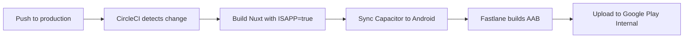

# CircleCI Continuous Integration

This document explains how continuous integration works for the Freegle monorepo using CircleCI.

## Overview

The Freegle monorepo uses a **shared CircleCI orb** (`freegle/tests`) that provides reusable CI/CD jobs and commands. The orb is defined in `.circleci/orb/freegle-tests.yml`.

### Why This Architecture?

- **Code Reuse**: CI logic defined once in the orb, used everywhere
- **Integration Testing**: Tests the complete system as users experience it
- **Resource Efficiency**: One comprehensive test environment vs. multiple isolated ones
- **Realistic Testing**: Tests against production-like Docker Compose stack
- **Consistency**: All components tested together with same configuration
- **Path-Based Skipping**: Only relevant test suites run when changes are limited to one component

## Test Suites

| Component | Directory | Test Type | Coverage |
|-----------|-----------|-----------|----------|
| **Go API** | `iznik-server-go/` | Go unit tests with race detection | Coveralls |
| **PHP API** | `iznik-server/` | PHPUnit with MySQL, Redis | Coveralls |
| **Laravel Batch** | `iznik-batch/` | Laravel PHPUnit tests | Coveralls |
| **Frontend** | `iznik-nuxt3/` | Vitest unit tests | Coveralls |
| **E2E** | `iznik-nuxt3/` | Playwright end-to-end tests | Coveralls |

## Freegle Tests Orb

The shared CircleCI orb is defined in `.circleci/orb/freegle-tests.yml` and published to CircleCI's orb registry.

### Available Jobs

| Job | Description |
|-----|-------------|
| `freegle/build-and-test` | Full test suite (Go + PHP + Laravel + Vitest + Playwright) |

### Publishing Orb Updates

```bash
# Validate
docker run --rm -v $(pwd)/.circleci/orb:/orb circleci/circleci-cli:alpine orb validate /orb/freegle-tests.yml

# Publish (requires CIRCLECI_TOKEN in .env) - increment version as needed
source .env
docker run --rm -v $(pwd)/.circleci/orb:/orb circleci/circleci-cli:alpine orb publish /orb/freegle-tests.yml freegle/tests@X.Y.Z --token $CIRCLECI_TOKEN
```

### Unified Test Environment

The orb uses `testenv.php` from the repo root to set up test data. This unified file handles:
- Test groups, locations, and users
- Reference data (PAF addresses, weights, engage_mails, jobs)
- Community events, volunteering opportunities
- Isochrones, chat rooms, and messages

See `.circleci/orb/README.md` for full documentation.

## CircleCI Workflows

### Push-Triggered Testing
```yaml
build-test:
  triggers: Push to any branch
  purpose: Full integration testing
```

On non-master branches, path-based skipping avoids running unrelated test suites:
- Changes only in `iznik-server-go/` → only Go tests run
- Changes only in `iznik-nuxt3/` → only Vitest + Playwright tests run
- Changes only in `iznik-batch/` → only Laravel tests run
- On `master`, all test suites always run

### Auto-Merge to Production
When all tests pass on `master`, the branch is automatically merged to `production` (which triggers Netlify deploys).

## Environment Variables

The following variables should be configured in CircleCI:

### Required API Keys
```bash
GOOGLE_CLIENT_ID=your_google_client_id.apps.googleusercontent.com
GOOGLE_CLIENT_SECRET=your_google_client_secret
GOOGLE_PUSH_KEY=your_google_push_key
GOOGLE_VISION_KEY=your_google_vision_key
GOOGLE_PERSPECTIVE_KEY=your_google_perspective_key
GOOGLE_GEMINI_API_KEY=your_google_gemini_key
GOOGLE_PROJECT=your_google_project_id
GOOGLE_APP_NAME=Freegle
MAPBOX_KEY=your_mapbox_key
MAXMIND_ACCOUNT=your_maxmind_account
MAXMIND_KEY=your_maxmind_key
```

---

## Android App Automation

The Freegle Direct mobile app builds are triggered from the `production` branch.

### App Build Pipeline


```mermaid
graph LR
    A[Push to production] --> B[CircleCI detects change]
    B --> C[Build Nuxt with ISAPP=true]
    C --> D[Sync Capacitor to Android]
    D --> E[Fastlane builds AAB]
    E --> F[Upload to Google Play Internal]
```

**Build Steps:**
1. Install Node.js dependencies
2. Build Nuxt app as static site with `ISAPP=true`
3. Sync Capacitor to Android platform
4. Install Fastlane and Ruby dependencies
5. Decode Google Play API credentials from environment
6. Build Android App Bundle (AAB) with auto-incrementing version code
7. Upload to Google Play Console Internal Testing track

### Environment Variables (for Android Builds)

**Required:**
```bash
GOOGLE_PLAY_JSON_KEY=base64_encoded_service_account_json
```

This should be the base64-encoded Google Play service account JSON key with "Release Manager" permissions.

### Version Management

Version numbers are managed in `iznik-nuxt3/VERSION.txt`:
- **Version Name**: Read from `VERSION.txt` (e.g., "3.2.0")
- **Version Code**: Auto-incremented from latest Google Play Internal track

### Deployment Tracks

**Internal Testing** (Automated):
- Triggered automatically on push to `production`
- Uploaded via Fastlane
- Available to internal testers immediately

**Beta/Production** (Manual):
- Promoted manually via Fastlane commands:
  ```bash
  bundle exec fastlane android promote_beta       # Internal → Beta
  bundle exec fastlane android promote_production # Beta → Production
  ```

## Manual Testing

### Via CircleCI UI
1. Go to [CircleCI FreegleDocker Project](https://app.circleci.com/pipelines/github/Freegle/FreegleDocker)
2. Click "Trigger Pipeline"
3. Select branch and parameters

### Via API
```bash
curl -X POST \
  -H "Circle-Token: YOUR_CIRCLECI_TOKEN" \
  -H "Content-Type: application/json" \
  -d '{"branch": "master"}' \
  https://circleci.com/api/v2/project/github/Freegle/FreegleDocker/pipeline
```

## Monitoring & Debugging

### Build Artifacts
Each CircleCI build collects:
- **Docker Logs**: Complete container startup logs
- **Test Reports**: Playwright HTML test results
- **Container Status**: Health check results
- **Build Info**: Commit details and environment info

### Common Issues

**Docker Environment Issues:**
- Check container logs in build artifacts
- Verify service health check timeouts
- Review Docker Compose configuration

**Test Failures:**
- Access Playwright HTML reports via artifacts
- Check specific test failure patterns
- Review console errors and network issues

## Related Documentation

- [CircleCI Configuration Details](.circleci/README.md)
- [Playwright Testing](iznik-nuxt3/tests/e2e/README.md)
- [Docker Compose Setup](README.md#running)
- [Status Monitoring](README.md#monitoring)
